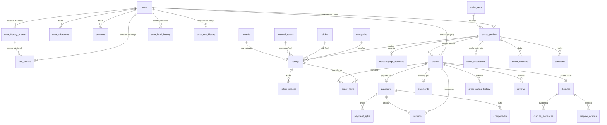

# Database Design (ERD) — OFFSIDE STORE

> **ERD v1.0 — CERRADO (2026-08-19).** Fuente de verdad del modelo de datos del MVP.
> Stack: **PostgreSQL + Drizzle ORM** (`tech-stack.md`). Regla: **la base sólo se
> modifica por migraciones de Drizzle.**
>
> Esta versión incorpora el cierre de Fase 1 (DEC-027…DEC-038), la resolución de
> inconsistencias I-1…I-5 y las **6 decisiones de modelado aprobadas** en la
> auditoría (`erd-audit-fase2.md` §15): Historial B (`user_history_events`), Config
> Store C (`seller_tiers` + `app_settings` + snapshots), `user_level`/`risk_level`
> en `users`, `seller_liability_status` OPEN/PARTIALLY_SETTLED/SETTLED/WRITTEN_OFF,
> `admin_role` enum, y `sku`/`moderation_status` en `listings`.
>
> **Todavía NO se genera código, Drizzle, migrations ni API contract.** Las
> decisiones de negocio PENDING no se inventan; los campos afectados quedan
> marcados 🟦 y su semántica se resuelve después (§22).

> ## ⚠️ ERD v1.1 — actualizado 2026-08-21 (por autorización explícita del owner)
>
> v1.0 quedó cerrado el 2026-08-19. Esta actualización **no cambia ninguna
> decisión de negocio de v1.0**: cierra dos gaps detectados al traducir el ERD a
> Drizzle. Cambios (detalle en §28):
>
> 1. **`catalog_change_requests`** — era la única tabla sin definición de
>    columnas. Se define su estructura y su ciclo de vida (**DEC-041**, §8.1).
> 2. **Búsqueda** — se cierra la técnica que estaba 🔵: `spanish` + `unaccent` +
>    `pg_trgm`, `search_vector` generado por el Service (**DEC-042**, §19.2).
> 3. **Enums: 33 → 35** (`catalog_request_status`, `catalog_target_type`).
> 4. **Extensiones de PostgreSQL requeridas** — nueva §1.b.
>
> El resto de v1.0 permanece **sin cambios**. Tablas: siguen siendo **50**.

> ## ⚠️ ERD v1.2 — actualizado 2026-08-21 (por autorización explícita del owner)
>
> Documenta el módulo de **identidad fiscal del vendedor**, que ya estaba
> implementado y dejaba el ERD desincronizado. Cambios (detalle en §29):
>
> 1. **`seller_tax_profiles`** — nueva tabla (§7.5). Tablas: 50 → **51**.
> 2. **Enums: 35 → 37** (`tax_id_type`, `tax_verification_status`).
>
> **Alcance estricto: SOLO identificación fiscal.** No se modela nada de
> percepciones, retenciones, comisiones, snapshots fiscales de órdenes ni
> tablas de ARCA — eso sigue 🔴 bajo DEC-011 (`legal.md` §2). El resto de v1.1
> permanece **sin cambios**.

> ## ⚠️ ERD v1.3 — actualizado 2026-09-09 (por autorización explícita del owner)
>
> Documenta la **supresión de direcciones de email**, que ya estaba implementada
> y dejaba el ERD desincronizado. Cambios (detalle en §30):
>
> 1. **`email_suppressions`** — nueva tabla (§18.1). Tablas: 51 → **52**.
> 2. **Enums: 37 → 38** (`email_suppression_reason`).
> 3. **`citext`** pasa a usarse también en `email_suppressions.email` (§1.b).
>
> **Alcance estricto: sólo qué direcciones dejaron de recibir email y por qué.**
> No se modela un registro de envíos ni el estado de entrega de cada mensaje:
> `notifications` (§18) sigue siendo la bandeja in-app y no cambia. El resto de
> v1.2 permanece **sin cambios**.

Convención de marcas: ✅ estable · 🟦 estructura lista pero **semántica/valores
PENDING** · 🌐 dependencia externa (MP/Correo, no inventar).

---

## 1. Convenciones globales

| Convención | Regla |
|-----------|-------|
| **Nombres** | `snake_case`; tablas en **plural**; FK = `<entidad>_id`. |
| **Primary key** | `id uuid PRIMARY KEY DEFAULT gen_random_uuid()`. 💡 UUID v7 (ordenable) si la app lo genera. |
| **Timestamps** | `created_at timestamptz NOT NULL DEFAULT now()`; `updated_at timestamptz` gestionado por la app. |
| **Soft delete** | Entidades de negocio **no** se hard-deletean: `status`/`deleted_at`. Sólo efímeras (sesiones, tokens) se borran. |
| **Dinero** | **`bigint` en centavos**, nunca `float`. **Toda** tabla con importes lleva `currency char(3) NOT NULL DEFAULT 'ARS'`. |
| **Snapshots económicos** | Los valores económicos usados en una operación se **copian** a la transacción y **nunca** se recalculan con config futura (DEC-030/038). |
| **Enums** | `pgEnum` para conjuntos estables; `text`+`CHECK` para lo volátil/externo (estados crudos MP/Correo). Los códigos de enum son `SCREAMING_SNAKE`; la etiqueta visible va en la UI. |
| **Semiestructurado** | `JSONB` para snapshots, payloads crudos y atributos extra; `GIN` si se filtra. |
| **FKs** | `ON DELETE RESTRICT` por defecto; `CASCADE` sólo en hijos dependientes (imágenes, ítems, eventos de tracking, evidencias). |
| **Auditoría** | Cambios sensibles (dinero, sanciones, disputas, credenciales, precio/autenticidad, config) → `audit_log`. Los eventos de dominio de confianza → `user_history_events` (fuente de verdad, DEC-036). |
| **Índices** | PK + únicos explícitos; FKs indexadas; facetas de búsqueda en `listings`. |
| **IDs externos** | Terceros (MP, Correo) como `text` en `*_external_id`/`mp_*_id`, nunca PK propia; el **estado crudo** se conserva (`mp_status`/`raw`). |

## 1.b Extensiones de PostgreSQL requeridas (v1.1)

El modelo depende de tres extensiones. **La primera migración debe crearlas antes
de las tablas que las usan**; ninguna herramienta las genera automáticamente.

```sql
CREATE EXTENSION IF NOT EXISTS citext;    -- users.email (§5.1), email_suppressions.email (§18.1)
CREATE EXTENSION IF NOT EXISTS unaccent;  -- búsqueda: acentos (§19.2)
CREATE EXTENSION IF NOT EXISTS pg_trgm;   -- búsqueda: tolerancia a typos (§19.2)
```

| Extensión | Para qué | Si falta |
|-----------|----------|----------|
| `citext` | `users.email` y `email_suppressions.email` case-insensitive | falla la creación de `users` |
| `unaccent` | normalizar acentos en la búsqueda en español | la búsqueda distingue "camiseta"/"camisetá" |
| `pg_trgm` | índices trigram → tolerancia a errores de escritura (PS-020.b) | no se pueden crear los índices GIN trigram de §9.1 |

⚠️ `CREATE EXTENSION` requiere privilegios elevados. Verificar en el entorno de
despliegue (Coolify) que el rol de la aplicación pueda crearlas, o pedir que se
creen previamente.

---

## 2. Módulos y mapa de tablas (v1.0)

| Módulo | Tablas |
|--------|--------|
| **auth** | `users`, `sessions`, `oauth_accounts`, `email_verification_tokens`, `password_reset_tokens` |
| **users** | `user_addresses`, `identity_verifications`, `user_history_events` ⭐, `user_level_history` ⭐, `user_risk_history` ⭐(ex `seller_risk_history`) |
| **sellers** | `seller_profiles`, `seller_tiers` ⭐, `mercadopago_accounts`, `seller_reputations` (cache derivado), `seller_tax_profiles` ⭐ (v1.2) |
| **catalog** | `categories`, `clubs`, `national_teams`, `brands`, `competitions`, `countries`, `seasons`, `size_charts`, `catalog_change_requests` |
| **listings** | `listings`, `listing_images`, `listing_price_history` |
| **cart/favorites** | `carts`, `cart_items`, `favorites` |
| **orders** | `orders`, `order_items`, `order_status_history` |
| **payments** | `payments`, `payment_splits`, `payment_webhook_events`, `refunds`, `chargebacks`, `seller_liabilities`, `reconciliation_records` |
| **shipments** | `shipments`, `shipment_tracking_events` |
| **disputes** | `disputes`, `dispute_evidences`, `dispute_actions` |
| **reviews** | `reviews` |
| **trust & safety** | `risk_events`, `sanctions` |
| **config** | `app_settings` ⭐ |
| **notifications** | `notifications`, `email_suppressions` ⭐ (v1.3) |
| **audit** | `audit_log` |

⭐ = nueva o renombrada en v1.0. POST-MVP (no creadas aún): `saved_searches`,
`follows` (DEC-024). Fiscal (`invoices`): 🔴 PENDING (DEC-011), no modelada.

---

## 3. Enumeraciones (`pgEnum`)

```
user_status             : active | suspended | deleted
user_level              : NUEVO | CONFIABLE | DESTACADO | COLECCIONISTA | TIENDA      (DEC-020)
risk_level              : NORMAL | RIESGO | RESTRINGIDO | SUSPENDIDO                  (DEC-021, en users)
admin_role              : SUPER_ADMIN | ADMIN | MODERATOR | SUPPORT | FINANCE         (DEC-023)
identity_status         : unverified | pending | verified | rejected
seller_status           : pending | approved | limited | suspended | expelled
mp_connection_status    : connected | expired | revoked | disconnected
listing_status          : draft | active | paused | sold_out | deleted
moderation_status       : PENDING | APPROVED | REJECTED | SUSPENDED                  (DEC-06/listings)
garment_category        : camiseta | short | buzo | campera | conjunto | entrenamiento
kit_type                : home | away | third | goalkeeper | special
sleeve                  : short | long
version_type            : player | fan | match_worn | other
item_condition          : NUEVO | COMO_NUEVO | EXCELENTE | MUY_BUENO | BUENO | ACEPTABLE   (DEC-025) 🟦 descripciones
authenticity            : NO_ESPECIFICADA | ORIGINAL_DECLARADA | REPLICA_OFICIAL | VERIFICADA | SOSPECHOSA | FALSIFICACION  (DEC-025) 🟦 evidencia
order_status            : PENDING_PAYMENT | PAID | PROCESSING | SHIPPED | DELIVERED | COMPLETED | CANCELLED   (DEC-029/034)
payment_status          : PENDING | IN_PROCESS | APPROVED | REJECTED | CANCELLED | REFUNDED | PARTIALLY_REFUNDED | CHARGED_BACK  (DEC-028/035)
refund_type             : FULL | PARTIAL
refund_status           : REQUESTED | UNDER_REVIEW | APPROVED | PROCESSING | COMPLETED | REJECTED   (DEC-031)
seller_liability_status : OPEN | PARTIALLY_SETTLED | SETTLED | WRITTEN_OFF           (aprobado Fase 2)
shipment_status         : created | dispatched | in_transit | delivered | delivery_issue | returned
dispute_reason          : not_received | different_from_listing | counterfeit | condition_mismatch | size_mismatch | damaged | wrong_description | other
dispute_status          : OPEN | WAITING_SELLER | UNDER_REVIEW | RESOLVED            (DEC-009)
dispute_resolution      : no_action | partial_refund | full_refund | return_required | seller_penalty | seller_suspended
sanction_type           : warning | limitation | suspension | expulsion | penalty
actor_type              : user | seller | admin | system
evidence_uploader       : buyer | seller | admin
history_event_type      : USER_REGISTERED | PURCHASE_COMPLETED | SALE_COMPLETED | ORDER_CANCELLED | DISPUTE_OPENED | DISPUTE_RESOLVED | REFUND_CREATED | REFUND_COMPLETED | REVIEW_RECEIVED | POLICY_VIOLATION_CONFIRMED | ACCOUNT_SUSPENDED   (DEC-036/040) 🟦 lista ampliable — SÓLO HECHOS, sin interpretación de riesgo
risk_type               : HIGH_CANCELLATION_RATE | EXCESSIVE_DISPUTES | CONFIRMED_COUNTERFEIT | UNUSUAL_ACTIVITY | MULTIPLE_ACCOUNTS | CHARGEBACK_PATTERN   (DEC-040) 🟦 ampliable
risk_severity           : LOW | MEDIUM | HIGH
risk_source             : SYSTEM | ADMIN
notification_type       : order | payment | shipment | dispute | price_alert | system
config_scope            : global | seller_tier | category
catalog_request_status  : PENDING | APPROVED | REJECTED                               (DEC-041, v1.1)
catalog_target_type     : club | national_team | brand | competition | country | season | size_chart   (DEC-041, v1.1)
tax_id_type             : CUIT | CUIL | CDI                                           (v1.2, §7.5)
tax_verification_status : PENDING | VERIFIED | REJECTED                               (v1.2, §7.5)
email_suppression_reason: BOUNCE | COMPLAINT                                          (v1.3, §18.1)
```

> **`tax_id_type`** — no se asume que todo vendedor tenga CUIT: una persona física
> sin actividad comercial puede tener CUIL, y CDI aplica a quien no tiene ninguno
> de los dos. Por eso hay `tax_id_type` + `tax_id`, y **no** una columna `cuit`.
> **`tax_verification_status`** es el resultado de la verificación contra la
> **fuente oficial**, no de la validación sintáctica. Hoy sólo `PENDING` es
> alcanzable: no hay integración fiscal. `VERIFIED`/`REJECTED` se declaran ahora
> para evitar un `ALTER TYPE` posterior (§26.1).

> **`catalog_request_status` NO reutiliza `moderation_status`** (DEC-041): moderar
> una publicación y gobernar el catálogo son conceptos distintos, y `SUSPENDED` no
> tiene sentido para una solicitud.
> **`catalog_target_type`** contiene exactamente los **catálogos controlados** que
> lista `product-specification.md` §4.3 (clubes, selecciones, marcas,
> competiciones, países, temporadas, tabla de talles). **No** incluye `categories`,
> que es un conjunto fijo respaldado por el enum `garment_category` y no se propone.

> **`seller_tier` NO es enum** — es la tabla `seller_tiers` (DEC-037), para poder
> configurar tiers sin migración. 🟦 sus valores concretos no se definen todavía.
> 🌐 **MP:** el `payment_status` es el estado **normalizado**; el crudo va en
> `payments.mp_status`/`raw` con **mapeo explícito** (DEC-035).

---

## 4. Diagrama ER (núcleo v1.0)



`app_settings` y `audit_log` son transversales (sin FK obligatoria al núcleo).
Cardinalidad clave: **1 orden = 1 vendedor** (DEC-026). Los ciclos de vida
**Order / Payment / Refund / Dispute son independientes** y se relacionan por
**referencia** (DEC-034).

---

## 5. Módulo AUTH

### 5.1 `users`
Cuenta base (comprador y/o vendedor). **Aloja `user_level` y `risk_level`** (aplican
al usuario, no sólo al vendedor — decisión Fase 2 §3).

| Columna | Tipo | Null | Default | Notas |
|---------|------|------|---------|-------|
| id | uuid | no | gen_random_uuid() | PK |
| email | citext | no | — | **UNIQUE** (case-insensitive). |
| password_hash | text | sí | — | Null si sólo OAuth externo. argon2/bcrypt. |
| email_verified_at | timestamptz | sí | — | Null = no verificado (BR-001). |
| phone | text | sí | — | |
| phone_verified_at | timestamptz | sí | — | Señal de identidad (DEC-036/TS). |
| display_name | text | sí | — | |
| username | text | sí | — | **UNIQUE** (nullable). Perfil público (Bloque 11). |
| status | user_status | no | 'active' | active/suspended/deleted. |
| **user_level** | user_level | no | 'NUEVO' | Trayectoria/confianza (DEC-020). Derivado del historial. |
| **risk_level** | risk_level | no | 'NORMAL' | Moderación (DEC-021). Derivado del historial/eventos. |
| **admin_role** | admin_role | sí | — | Null = no admin. Reemplaza `is_admin` (DEC-023). |
| created_at | timestamptz | no | now() | |
| updated_at | timestamptz | sí | — | |
| deleted_at | timestamptz | sí | — | Soft delete (eliminación de cuenta). |

Índices: `UNIQUE(email)`, `UNIQUE(username) WHERE username IS NOT NULL`,
`INDEX(status)`, `INDEX(user_level)`, `INDEX(risk_level)`, `INDEX(admin_role) WHERE admin_role IS NOT NULL`.
Reglas: no opera sin `email_verified_at` (BR-001). El rol vendedor se determina por
la existencia de `seller_profiles`. Cambios de `user_level`/`risk_level`/`status`/
`admin_role` → `audit_log` (+ el evento causal en `user_history_events`).

### 5.2 `sessions`
| Columna | Tipo | Null | Notas |
|---------|------|------|-------|
| id | uuid | no | PK |
| user_id | uuid | no | FK→users (CASCADE) |
| token_hash | text | no | Hash del token (nunca plano). UNIQUE. |
| user_agent | text | sí | |
| ip | inet | sí | |
| expires_at | timestamptz | no | |
| created_at | timestamptz | no | |

Índices: `UNIQUE(token_hash)`, `INDEX(user_id)`, `INDEX(expires_at)`.

### 5.3 `oauth_accounts`
OAuth de **login** (Google/Apple). **No** es Mercado Pago (que es cobro, en
`mercadopago_accounts`).

| Columna | Tipo | Null | Notas |
|---------|------|------|-------|
| id | uuid | no | PK |
| user_id | uuid | no | FK→users (CASCADE) |
| provider | text | no | 'google'/'apple'/… |
| provider_account_id | text | no | |
| created_at | timestamptz | no | |

Índices: `UNIQUE(provider, provider_account_id)`, `INDEX(user_id)`.

### 5.4 `email_verification_tokens` / 5.5 `password_reset_tokens`
Efímeras. `id, user_id FK(CASCADE), token_hash UNIQUE, expires_at, consumed_at,
created_at`.

---

## 6. Módulo USERS

### 6.1 `user_addresses`
| Columna | Tipo | Null | Notas |
|---------|------|------|-------|
| id | uuid | no | PK |
| user_id | uuid | no | FK→users (CASCADE) |
| label | text | sí | "Casa"/"Trabajo" |
| recipient_name | text | no | |
| phone | text | sí | |
| street | text | no | |
| number | text | sí | |
| apartment | text | sí | |
| city | text | no | |
| province | text | no | |
| postal_code | text | no | Clave para cotizar envío. |
| country_id | uuid | no | FK→countries (default AR). |
| is_default | boolean | no | |
| created_at | timestamptz | no | |

Índices: `INDEX(user_id)`. En `orders`/`shipments` la dirección se guarda como
**snapshot** (no FK).

### 6.2 `identity_verifications`
Independiente del KYC de MP (TS-001, método 🟦).

`id, user_id FK, status identity_status, method text 🟦, data jsonb, reviewed_by
FK→users, verified_at, created_at`. Índices: `INDEX(user_id)`, `INDEX(status)`.

### 6.3 `user_history_events` ⭐ (FUENTE DE VERDAD — HECHOS — DEC-036/040)
Log **append-only** de **hechos objetivos** ocurridos sobre un usuario ("¿qué
pasó?"). Es la **fuente de verdad**. **No** contiene interpretaciones de riesgo
(`HIGH_RISK`, `FRAUD`, etc.) — eso vive en `risk_events` (§16.1). `user_level`,
`risk_level` y `seller_reputations` se **derivan** de acá; los hechos **nunca**
desaparecen ni se modifican.

| Columna | Tipo | Null | Notas |
|---------|------|------|-------|
| id | uuid | no | PK |
| user_id | uuid | no | FK→users (RESTRICT). Sujeto del hecho. |
| event_type | history_event_type | no | Hechos: USER_REGISTERED/PURCHASE_COMPLETED/SALE_COMPLETED/ORDER_CANCELLED/DISPUTE_OPENED/DISPUTE_RESOLVED/REFUND_CREATED/REFUND_COMPLETED/REVIEW_RECEIVED/POLICY_VIOLATION_CONFIRMED/ACCOUNT_SUSPENDED. 🟦 ampliable. |
| role | text | sí | 'buyer'/'seller' según el rol en el hecho. |
| ref_entity_type | text | sí | 'order'/'dispute'/'refund'/'review'/… |
| ref_entity_id | uuid | sí | Referencia al origen. |
| data | jsonb | sí | Payload del hecho (montos, motivo, etc.). |
| created_at | timestamptz | no | Momento del hecho. |

Índices: `INDEX(user_id, created_at)`, `INDEX(event_type)`,
`INDEX(ref_entity_type, ref_entity_id)`.
Reglas: **inmutable** (no update/delete). Se emite en el mismo punto lógico que
escribe `audit_log`. Sólo **hechos**, no interpretaciones. 🟦 la **fórmula** de
nivel/riesgo (umbrales DEC-020/021) queda PENDING; la **estructura** soporta
cualquier fórmula (Risk Engine futuro).

### 6.4 `user_level_history` ⭐ / 6.5 `user_risk_history` ⭐
Auditan transiciones de nivel y de riesgo del **usuario** (`user_risk_history`
reemplaza al viejo `seller_risk_history`).

| Columna | Tipo | Notas |
|---------|------|-------|
| id | uuid | PK |
| user_id | uuid | FK→users |
| from_value | user_level / risk_level | |
| to_value | user_level / risk_level | |
| reason | text | |
| triggered_by | actor_type | system (auto) / admin (manual) |
| admin_id | uuid | FK→users, null si automático |
| created_at | timestamptz | |

Índices: `INDEX(user_id, created_at)`.

---

## 7. Módulo SELLERS

### 7.1 `seller_tiers` ⭐ (DEC-037 — categoría comercial)
Config de dominio (parte del Config Store, opción C). Independiente del `user_level`.

| Columna | Tipo | Null | Notas |
|---------|------|------|-------|
| id | uuid | no | PK |
| code | text | no | **UNIQUE** (ej. STANDARD/VERIFIED/…). 🟦 valores no definidos. |
| name | text | no | Etiqueta visible. |
| commission_rate | numeric(6,4) | sí | Tasa por defecto del tier (⚙️ Config; 🟦 valor). |
| limits | jsonb | sí | Límites (publicaciones, montos…). 🟦 |
| benefits | jsonb | sí | Beneficios/condiciones. 🟦 |
| is_active | boolean | no | |
| created_at | timestamptz | no | |
| updated_at | timestamptz | sí | |

Índices: `UNIQUE(code)`. Cambios → `audit_log`. **No se seedean valores** hasta
definir DEC-037 (🟦).

### 7.2 `seller_profiles`
1:1 con `users`. Aloja `seller_tier_id` (comercial). **NO** aloja `user_level`/
`risk_level` (esos viven en `users`).

| Columna | Tipo | Null | Default | Notas |
|---------|------|------|---------|-------|
| id | uuid | no | | PK |
| user_id | uuid | no | | FK→users. **UNIQUE**. |
| **seller_tier_id** | uuid | sí | | FK→seller_tiers (DEC-037). Null = sin tier asignado. |
| display_name | text | no | | Nombre de tienda. |
| bio | text | sí | | Perfil público (Bloque 11). |
| status | seller_status | no | 'pending' | Habilitación para vender. |
| dispatch_location | jsonb | sí | | Localidad de despacho. |
| shipping_policy | text | sí | | |
| approved_at | timestamptz | sí | | |
| created_at | timestamptz | no | now() | |
| updated_at | timestamptz | sí | | |

Índices: `UNIQUE(user_id)`, `INDEX(status)`, `INDEX(seller_tier_id)`.
Reglas: pasa a `approved` con identidad + MP conectado + términos + no en riesgo que
lo impida (TS-010). MP conectado ≠ confianza (BR-003). Cambio de `seller_tier_id` →
`audit_log`; **no** afecta órdenes históricas (que snapshotean tier/comisión —
CASO 8). Cambios de `status` → `audit_log`.

### 7.3 `mercadopago_accounts`
Conexión OAuth (DEC-005). **Datos sensibles, cifrados.** (Sin cambios vs v0.1.)

`id, seller_id FK UNIQUE, mp_user_id text UNIQUE, access_token_encrypted,
refresh_token_encrypted, token_expires_at, scopes text[], public_key, status
mp_connection_status, connected_at, last_refreshed_at, created_at, updated_at`.
Índices: `UNIQUE(seller_id)`, `UNIQUE(mp_user_id)`, `INDEX(status)`,
`INDEX(token_expires_at)`. Si `status ≠ connected` → no vende (SS-013). **Nunca**
exponer por API. 🌐 vida/rotación de tokens a verificar.

### 7.4 `seller_reputations` (CACHE DERIVADO — DEC-036)
**Ya no es fuente de verdad.** Proyección recomputable desde `user_history_events`.

| Columna | Tipo | Notas |
|---------|------|-------|
| seller_id | uuid | PK + FK→seller_profiles (1:1). |
| sales_count / cancellations_count / claims_count / refunds_count | int | Contadores derivados. |
| avg_dispatch_hours | numeric(8,2) | |
| rating_avg | numeric(3,2) | |
| rating_count | int | |
| counterfeit_flags | int | |
| score | numeric(6,2) | **Derivado, no autoridad** (DEC-036); nullable/recomputable. |
| computed_at | timestamptz | Última recomputación. |

### 7.5 `seller_tax_profiles` ⭐ (v1.2) — identidad fiscal del vendedor

Identificación fiscal declarada por el vendedor y, cuando exista la integración,
el resultado de verificarla contra la fuente oficial.

**Alcance: SOLO identificación.** No modela percepciones, retenciones,
comisiones ni comprobantes: eso sigue 🔴 bajo DEC-011 (`legal.md` §2).

| Columna | Tipo | Null | Default | Notas |
|---------|------|------|---------|-------|
| id | uuid | no | gen_random_uuid() | PK |
| seller_id | uuid | no | — | FK→seller_profiles (RESTRICT). |
| tax_id_type | tax_id_type | no | — | CUIT / CUIL / CDI. Lo **declarado**. |
| tax_id | text | no | — | **Normalizado: sólo dígitos** (`20-12345678-6` → `20123456786`). El formateo es de la UI. |
| verification_status | tax_verification_status | no | 'PENDING' | Resultado de la verificación contra la **fuente oficial**. |
| source | text | sí | — | Qué fuente respondió. Null mientras no haya integración. |
| checked_at | timestamptz | sí | — | Cuándo se consultó. Null mientras no haya integración. |
| tax_condition | text | sí | — | Qué dijo la fuente. **`text` y NO enum**: los valores los define la fuente y todavía no se conocen. |
| valid_from | timestamptz | no | now() | Inicio de vigencia. |
| valid_to | timestamptz | sí | — | **Null = fila VIGENTE.** Se completa al reemplazarla. |
| created_at | timestamptz | no | now() | |
| updated_at | timestamptz | sí | — | |

Índices: `UNIQUE(seller_id) WHERE valid_to IS NULL`, `INDEX(seller_id)`,
`INDEX(verification_status)`, `INDEX(tax_id)`.

**Historial (sin segunda tabla).** La condición fiscal de una persona cambia con
el tiempo, así que la tabla es append-only por diseño:

- puede existir **más de un registro histórico** por vendedor;
- sólo puede existir **uno vigente**;
- el vigente es el que tiene **`valid_to IS NULL`**;
- los anteriores se **cierran** estableciendo `valid_to`; nada se borra ni se
  sobrescribe.

El índice único parcial es lo que garantiza la unicidad del vigente.

**Separación de responsabilidades — no mezclar:**

| | Qué responde |
|---|---|
| `tax_id_type` + `tax_id` | lo que **declaró** el vendedor |
| `verification_status` | si la **fuente oficial** lo confirmó |
| `tax_condition` | **qué dijo** esa fuente |

Que un identificador pase la validación sintáctica (formato + dígito
verificador) **no lo vuelve verificado**.

Reglas:

- Cargar identidad fiscal **NO aprueba al vendedor**: `seller_profiles.status`
  sigue en `pending`. La aprobación es un paso aparte y depende de TS-001 (🟡).
- ⚠️ **`tax_condition` NO deriva comisiones ni percepciones.** La identidad
  fiscal y las reglas de comisión son conceptos desacoplados: el módulo fiscal
  identifica al vendedor, y `payments` decidirá después qué hacer con esa
  información. La dependencia va `payments → fiscal`, nunca al revés.
- No se pide DNI, foto, selfie ni documentación adicional.

🔵 La integración con la fuente fiscal (ARCA) **no está implementada**: servicio,
credenciales, ambientes y cadencia de refresco quedan por investigar.

---

## 8. Módulo CATALOG

Forma común: `id, name, slug UNIQUE, aliases text[], is_active, timestamps`.
Tablas: `categories` (`code garment_category UNIQUE`, `required_attributes jsonb`
🟦 OQ-F1), `clubs`, `national_teams`, `brands`, `competitions`, `countries`
(`iso_code char(2) UNIQUE`), `seasons` (`label UNIQUE`), `size_charts` (🟦 OQ-F3).

`catalog_change_requests` **no** sigue la forma común: se define en §8.1.

### 8.1 `catalog_change_requests` ⭐ (DEC-041, v1.1)

Solicitud de **alta** de un ítem de catálogo controlado. Existe para que un
vendedor pueda proponer un club/marca/competición que falta **sin escribir
directamente** en las tablas de catálogo — evitando "datos sucios", que
`product-specification.md` §11 identifica como el riesgo que **mata el
diferencial** de la búsqueda facetada.

**Regla dura: la solicitud NO modifica el catálogo.** Sólo la **aprobación** crea
la entidad correspondiente, y el `id` creado se guarda en `created_entity_id`.

| Columna | Tipo | Null | Default | Notas |
|---------|------|------|---------|-------|
| id | uuid | no | gen_random_uuid() | PK |
| target_type | catalog_target_type | no | — | A qué catálogo apunta. |
| payload | jsonb | no | — | **Snapshot inmutable** de la propuesta original, tal como se envió. No cambia aunque luego se edite la entidad creada. |
| requested_by | uuid | no | — | FK→users. Quién propuso. |
| status | catalog_request_status | no | 'PENDING' | PENDING → APPROVED \| REJECTED. |
| reviewed_by | uuid | sí | — | FK→users. Null hasta que se revise. |
| reviewed_at | timestamptz | sí | — | Null hasta que se revise. |
| review_note | text | sí | — | Motivo de la resolución. Obligatorio al rechazar (validado en app). |
| created_entity_id | uuid | sí | — | Entidad creada al aprobar. **Sin FK**: la tabla destino depende de `target_type` (referencia polimórfica, igual que `audit_log.entity_id`). |
| created_at | timestamptz | no | now() | |
| updated_at | timestamptz | sí | — | |

Índices: `INDEX(status)`, `INDEX(requested_by)`, `INDEX(target_type)`.

Reglas:

- **Autorización:** quién puede crear solicitudes y quién puede aprobarlas se
  resuelve en la **capa de permisos** (roles de DEC-023), **no** en el modelo de
  datos. Por eso `requested_by` apunta a `users` y no a `seller_profiles`: la
  tabla no se acopla al rol.
- Toda resolución (aprobación o rechazo) → `audit_log` (AR-001).
- `payload` es `jsonb` porque la forma varía según `target_type`: un club no
  tiene los mismos campos que una temporada.
- No se hard-deletea: es un registro de decisiones.

🟦 Fuera del MVP (no modelados): detección de duplicados (`duplicate_of_id`),
evidencia adjunta, SLA de revisión, y propuestas de **edición**/**fusión** de
ítems existentes — hoy el alcance es **sólo alta** (`product-specification.md`
§4.3).

---

## 9. Módulo LISTINGS

### 9.1 `listings`
Modelo especializado de fútbol. **Agrega `sku` y `moderation_status`** (decisión
Fase 2 §6); `moderation_status` es **independiente** de `status`.

| Columna | Tipo | Null | Default | Notas |
|---------|------|------|---------|-------|
| id | uuid | no | | PK |
| seller_id | uuid | no | | FK→seller_profiles. |
| category_id | uuid | no | | FK→categories. |
| **sku** | text | sí | | SKU del vendedor. `UNIQUE(seller_id, sku)` cuando no null. |
| status | listing_status | no | 'draft' | draft/active/paused/sold_out/deleted (BR-014). |
| **moderation_status** | moderation_status | no | 'PENDING' | PENDING/APPROVED/REJECTED/SUSPENDED. **Independiente** de `status`. |
| title | text | no | | |
| description | text | sí | | |
| price_amount | bigint | no | | Centavos. |
| currency | char(3) | no | 'ARS' | |
| stock | int | no | 1 | ≥0. Descuento al pago (MF-022). |
| club_id | uuid | sí | | FK→clubs. |
| national_team_id | uuid | sí | | FK→national_teams. |
| brand_id | uuid | sí | | FK→brands. |
| competition_id | uuid | sí | | FK→competitions. |
| country_id | uuid | sí | | FK→countries (fabricación). |
| season_id | uuid | sí | | FK→seasons. |
| year | int | sí | | |
| model | text | sí | | |
| version | version_type | sí | | |
| kit_type | kit_type | sí | | oblig. camiseta. |
| sleeve | sleeve | sí | | oblig. camiseta. |
| player_name | text | sí | | |
| player_number | int | sí | | |
| sponsor | text | sí | | |
| size_value | text | no | | Normalizado contra `size_charts`. |
| measurements | jsonb | sí | | {chest_cm, length_cm}. |
| condition | item_condition | no | | NUEVO…ACEPTABLE (DEC-025). |
| authenticity | authenticity | no | 'NO_ESPECIFICADA' | Declarada (TS-030/032). |
| is_retro | boolean | no | false | 🟦 definición retro/vintage. |
| search_vector | tsvector | sí | | Full-text (§19). Generated/trigger. |
| extra_attributes | jsonb | sí | | Semiestructurado. |
| published_at | timestamptz | sí | | Al pasar a `active`. |
| created_at | timestamptz | no | now() | |
| updated_at | timestamptz | sí | | |
| deleted_at | timestamptz | sí | | Soft delete. |

Índices: `UNIQUE(seller_id, sku) WHERE sku IS NOT NULL`, `INDEX(seller_id)`,
`INDEX(status)`, `INDEX(moderation_status)`, `INDEX(category_id)`, `INDEX(club_id)`,
`INDEX(national_team_id)`, `INDEX(brand_id)`, `INDEX(competition_id)`,
`INDEX(season_id)`, `INDEX(price_amount)`, `INDEX(condition)`, `INDEX(authenticity)`,
`INDEX(is_retro)`, `GIN(search_vector)`, `GIN(extra_attributes)`; compuestos
`(status, category_id, club_id)`, `(status, price_amount)`.
**Trigram (v1.1, DEC-042):** `GIN(title gin_trgm_ops)`,
`GIN(player_name gin_trgm_ops)`, `GIN(model gin_trgm_ops)` — habilitan la
tolerancia a errores de escritura (PS-020.b). Se eligen los campos **cortos y de
alta señal**; `description` queda **excluida** a propósito por costo de índice.
CHECK: `stock >= 0`, `price_amount > 0`.
Reglas: comprable sólo si `status='active'` **y** `moderation_status='APPROVED'` **y**
`stock ≥ 1`. Cambios de `price_amount`/`authenticity`/`condition` →
`listing_price_history` + `audit_log` (BR-015).

### 9.2 `listing_images`
`id, listing_id FK(CASCADE), storage_key, url, variants jsonb, position int, alt,
hash, created_at`. `UNIQUE(listing_id, position)`, `INDEX(listing_id)`. ≥1 para
publicar (PS-010).

### 9.3 `listing_price_history`
`id, listing_id FK(CASCADE), old_price_amount bigint, new_price_amount bigint,
currency char(3), changed_by FK→users, created_at`. `INDEX(listing_id)`.

---

## 10. Módulo CART / FAVORITES

`carts` (`id, user_id FK UNIQUE, timestamps`). `cart_items` (`id, cart_id
FK(CASCADE), listing_id FK, quantity int, unit_price_snapshot bigint, currency,
created_at`; `UNIQUE(cart_id, listing_id)`). `favorites` (`id, user_id FK(CASCADE),
listing_id FK(CASCADE), created_at`; `UNIQUE(user_id, listing_id)`). No reservan
stock (MF-010).

---

## 11. Módulo ORDERS

### 11.1 `orders`
Ciclo **logístico** de la orden (DEC-029/034) + **snapshot financiero** inmutable
(DEC-030/038). Es la **fuente comercial**; `payment_splits` es la conciliación con MP.

| Columna | Tipo | Null | Default | Notas |
|---------|------|------|---------|-------|
| id | uuid | no | | PK |
| order_number | text | no | | UNIQUE (legible). |
| buyer_id | uuid | no | | FK→users. |
| seller_id | uuid | no | | FK→seller_profiles (1 orden = 1 vendedor). |
| status | order_status | no | 'PENDING_PAYMENT' | Ver §11.4. |
| currency | char(3) | no | 'ARS' | |
| product_amount | bigint | no | | Subtotal productos. |
| discount_amount | bigint | no | 0 | Descuentos (DEC-017). |
| shipping_amount | bigint | no | 0 | Envío. |
| total_amount | bigint | no | | **Total cobrado al comprador** (base de comisión, DEC-014). |
| **commission_rate_at_transaction** | numeric(6,4) | sí | | Tasa OFFSIDE aplicada (snapshot, DEC-030). |
| **commission_amount** | bigint | sí | | Comisión OFFSIDE. |
| **mp_fee_amount** | bigint | sí | | Costo real MP (no hardcodeado, 🌐). |
| **seller_amount** | bigint | sí | | Neto del vendedor. |
| **offside_amount** | bigint | sí | | Neto de OFFSIDE (comisión − MP absorbido). |
| **seller_tier_code_at_transaction** | text | sí | | Snapshot del tier (CASO 8). |
| shipping_address | jsonb | no | | **Snapshot** de dirección. |
| **payment_deadline** | timestamptz | sí | | Vence la ventana de pago (DEC-033; valor del Config Store). |
| buyer_note | text | sí | | |
| created_at | timestamptz | no | now() | |
| paid_at / shipped_at / delivered_at / completed_at / cancelled_at | timestamptz | sí | | |

Índices: `UNIQUE(order_number)`, `INDEX(buyer_id, created_at)`,
`INDEX(seller_id, status)`, `INDEX(status)`, `INDEX(status, payment_deadline)`
(expiración por jobs).
CHECK: `total_amount = product_amount - discount_amount + shipping_amount` (validado
en app; CHECK opcional); todos los `*_amount >= 0`.
Reglas: pasa a `PAID` sólo con pago validado por backend (DEC-028). El snapshot
financiero es **inmutable** (DEC-030); nunca se recalcula (CASO 6/8). Cambios de
estado → `order_status_history` + `audit_log`.

### 11.2 `order_items`
Snapshot inmutable de lo comprado. `id, order_id FK(CASCADE), listing_id FK(RESTRICT),
title_snapshot, attributes_snapshot jsonb, unit_price_amount bigint, currency,
quantity int, created_at`. `INDEX(order_id)`, `INDEX(listing_id)`.

### 11.3 `order_status_history`
`id, order_id FK(CASCADE), from_status order_status, to_status order_status,
actor_type, actor_id FK→users, note, created_at`. `INDEX(order_id)`.

### 11.4 Estados de orden
`PENDING_PAYMENT → PAID → PROCESSING → SHIPPED → DELIVERED → COMPLETED`; rama
`CANCELLED`. **Pago rechazado NO cancela** (DEC-033): queda en `PENDING_PAYMENT`
hasta reintento exitoso o hasta que venza `payment_deadline` / cancele comprador o
admin. Refund/disputa **no** son estados de Order (DEC-034).

---

## 12. Módulo PAYMENTS

> 🌐 Depende de MP; estados crudos en `mp_*`/`raw`. Mapeo explícito MP↔Offside
> (DEC-035).

### 12.1 `payments`
| Columna | Tipo | Null | Notas |
|---------|------|------|-------|
| id | uuid | no | PK |
| order_id | uuid | no | FK→orders. |
| mp_payment_id | text | sí | ID en MP. `UNIQUE WHERE NOT NULL`. |
| status | payment_status | no | Normalizado (DEC-028/035). |
| mp_status | text | sí | **Estado original de MP** (conservado, DEC-035). |
| mp_status_detail | text | sí | Detalle crudo. |
| idempotency_key | text | sí | `UNIQUE WHERE NOT NULL`. Idempotencia al crear (🌐 confirmar MP). |
| payment_method | text | sí | 🌐 |
| installments | int | sí | Cuotas (DEC-016). |
| amount | bigint | no | Importe pagado. |
| currency | char(3) | no | 'ARS'. |
| checkout_type | text | no | 'pro' (DEC-027). |
| raw | jsonb | sí | Payload crudo MP. |
| approved_at | timestamptz | sí | |
| created_at | timestamptz | no | |
| updated_at | timestamptz | sí | |

Índices: `INDEX(order_id)`, `UNIQUE(mp_payment_id) WHERE NOT NULL`,
`UNIQUE(idempotency_key) WHERE NOT NULL`, `INDEX(status)`.
Reglas: fuente de verdad = MP vía webhooks (PC-040), reconsulta + idempotencia.

### 12.2 `payment_splits`
Conciliación del reparto real de MP.
`id, payment_id FK(CASCADE), seller_amount bigint, marketplace_fee_amount bigint,
mp_fee_amount bigint 🌐, currency char(3), raw jsonb, created_at`. `INDEX(payment_id)`.

### 12.3 `payment_webhook_events`
Log **idempotente** (PC-041). `id, provider, event_type, resource_id,
idempotency_key text UNIQUE, signature_valid bool, payload jsonb, processed bool,
processed_at, error, received_at`. `UNIQUE(idempotency_key)`, `INDEX(resource_id)`,
`INDEX(processed)`.

### 12.4 `refunds`
| Columna | Tipo | Null | Notas |
|---------|------|------|-------|
| id | uuid | no | PK |
| order_id | uuid | no | FK→orders. |
| payment_id | uuid | no | FK→payments. |
| dispute_id | uuid | sí | FK→disputes. |
| type | refund_type | no | FULL/PARTIAL. |
| status | refund_status | no | REQUESTED/UNDER_REVIEW/APPROVED/PROCESSING/COMPLETED/REJECTED (DEC-031). |
| amount | bigint | no | Reembolsado al comprador. |
| currency | char(3) | no | 'ARS'. |
| seller_portion_amount | bigint | sí | 🌐 proporcional. |
| marketplace_portion_amount | bigint | sí | Comisión revertida. |
| seller_portion_recovered | boolean | no | Default false. |
| mp_refund_id | text | sí | |
| reason | text | sí | 🟦 motivos (DEC-031 pendiente). |
| raw | jsonb | sí | |
| created_at | timestamptz | no | |
| processed_at | timestamptz | sí | |

Índices: `INDEX(order_id)`, `INDEX(payment_id)`, `INDEX(status)`.
🟦 Reglas de reversa/costos/plazos PENDING (DEC-008/031). Si la parte del vendedor no
se recupera → `seller_liabilities`.

### 12.5 `chargebacks`
`id, order_id FK, payment_id FK, mp_chargeback_id text, status text 🌐, amount
bigint, currency char(3), evidence jsonb, raw jsonb, created_at, resolved_at`.
`INDEX(order_id)`, `INDEX(payment_id)`.

### 12.6 `seller_liabilities`
Deuda del vendedor. **Estados aprobados Fase 2.**

| Columna | Tipo | Null | Notas |
|---------|------|------|-------|
| id | uuid | no | PK |
| seller_id | uuid | no | FK→seller_profiles. |
| order_id | uuid | no | FK→orders (origen). |
| refund_id | uuid | sí | FK→refunds. |
| chargeback_id | uuid | sí | FK→chargebacks. |
| amount | bigint | no | Monto adeudado. |
| settled_amount | bigint | no | Default 0. Cubierto hasta ahora (soporta PARTIALLY_SETTLED). |
| currency | char(3) | no | 'ARS'. |
| status | seller_liability_status | no | **OPEN / PARTIALLY_SETTLED / SETTLED / WRITTEN_OFF**. |
| reason | text | sí | |
| admin_decision | jsonb | sí | Auditada. |
| created_at | timestamptz | no | |
| resolved_at | timestamptz | sí | |

Índices: `INDEX(seller_id)`, `INDEX(order_id)`, `INDEX(status)`.
CHECK: `settled_amount >= 0 AND settled_amount <= amount`.
🟦 **Reglas de recuperación de deuda PENDING** (DEC-019): sólo se modelan estados;
el motor de recupero/bloqueo/exposición no se define ahora.

### 12.7 `reconciliation_records`
`id, period_start date, period_end date, source text 🌐, summary jsonb,
discrepancies jsonb, status text (open/closed), created_by FK→users, created_at`.

---

## 13. Módulo SHIPMENTS

### 13.1 `shipments`
`id, order_id FK UNIQUE, provider text, status shipment_status, tracking_number
text, label_ref text, origin jsonb, destination jsonb, package_info jsonb,
cost_amount bigint, currency char(3), raw jsonb, created_at, dispatched_at,
delivered_at`. `UNIQUE(order_id)`, `INDEX(status)`, `INDEX(tracking_number)`.
El envío se crea desde la orden en `PROCESSING` (DEC-029). 🌐 Correo Argentino.

### 13.2 `shipment_tracking_events`
`id, shipment_id FK(CASCADE), status shipment_status, provider_status text 🌐,
description, occurred_at, raw jsonb, created_at`. `INDEX(shipment_id)`,
`INDEX(occurred_at)`. Evidencia en disputas (SH-002).

---

## 14. Módulo DISPUTES

### 14.1 `disputes`
Ciclo propio (DEC-034), independiente de la Order.
`id, order_id FK UNIQUE, buyer_id FK→users, seller_id FK→seller_profiles, reason
dispute_reason, status dispute_status (OPEN/WAITING_SELLER/UNDER_REVIEW/RESOLVED),
resolution dispute_resolution NULL, refunded_amount bigint, currency char(3),
opened_at, seller_response_due_at 🟦, seller_responded_at, resolved_at, created_at`.
`UNIQUE(order_id)`, `INDEX(status)`, `INDEX(seller_id)`, `INDEX(buyer_id)`.
🟦 plazos/resolución por defecto PENDING (DEC-009).

### 14.2 `dispute_evidences`
**Inmutable.** `id, dispute_id FK(CASCADE), uploaded_by evidence_uploader,
uploader_id FK→users, type text, storage_key, url, note, created_at`.
`INDEX(dispute_id)`.

### 14.3 `dispute_actions`
Efectos de la resolución (combinables). `id, dispute_id FK(CASCADE), action
dispute_resolution, amount bigint, currency char(3), decided_by FK→users, note,
created_at`. `INDEX(dispute_id)`.

---

## 15. Módulo REVIEWS

`reviews`: `id, order_id FK UNIQUE, rater_id FK→users, seller_id FK→seller_profiles,
rating int CHECK 1..5, comment text, created_at`. `UNIQUE(order_id)`,
`INDEX(seller_id)`. Sólo sobre órdenes `COMPLETED` (o `DELIVERED` según política).
Emite `user_history_events` (review recibida) para el vendedor.

---

## 16. Módulo TRUST & SAFETY

### 16.1 `risk_events` — SEÑALES DE RIESGO (interpretación — DEC-040)
Registra **cómo el sistema interpreta** ciertos hechos para evaluar riesgo ("¿qué
señal de riesgo detectamos?"). **No es fuente de verdad de hechos** (esos están en
`user_history_events`) y **nunca** los reemplaza ni modifica. Alimenta
`users.risk_level`.

| Columna | Tipo | Null | Notas |
|---------|------|------|-------|
| id | uuid | no | PK |
| user_id | uuid | no | FK→users. Sujeto de la señal. |
| risk_type | risk_type | no | HIGH_CANCELLATION_RATE/EXCESSIVE_DISPUTES/CONFIRMED_COUNTERFEIT/UNUSUAL_ACTIVITY/MULTIPLE_ACCOUNTS/CHARGEBACK_PATTERN. |
| severity | risk_severity | no | LOW/MEDIUM/HIGH. |
| source | risk_source | no | SYSTEM (motor) / ADMIN (manual). |
| reference_type | text | sí | 'SELLER_PROFILE'/'ORDER'/'DISPUTE'/… (contexto de la señal). |
| reference_id | uuid | sí | Referencia al contexto. |
| **source_history_event_id** | uuid | sí | FK→user_history_events (**nullable**). Origen directo si la señal viene de UN hecho; null si surge de varios/patrón. |
| metadata | jsonb | sí | Cómo se calculó (p. ej. "20 cancelaciones / 25 ventas"). |
| created_at | timestamptz | no | |
| resolved_at | timestamptz | sí | Cuándo dejó de aplicar la señal. |

Índices: `INDEX(user_id, created_at)`, `INDEX(risk_type)`, `INDEX(severity)`,
`INDEX(source_history_event_id)`.
> **Modelo (DEC-040):** `user_history_events` = **hechos**; `risk_events` =
> **interpretación**; `users.risk_level` = **estado actual**. Cambiar la lógica de
> riesgo (Risk Engine) **no** modifica el historial: los hechos persisten, sólo
> cambia la evaluación. Una señal puede originarse en **un** hecho
> (`source_history_event_id`), en **muchos**/un patrón (null + `metadata`), o en
> **reglas configuradas / eventos externos**.
> **MVP (DEC-040):** las señales iniciales se generan por **reglas simples y
> configurables**; **no** se implementa aún un Risk Engine complejo. 🟦 la
> **fórmula** completa y los umbrales quedan PENDING (DEC-020/021).

### 16.2 `sanctions`
Aplicadas al **vendedor** (capacidad de vender). `id, seller_id FK, type
sanction_type, reason, dispute_id FK, limitations jsonb, applied_by FK→users,
starts_at, ends_at, status text (active/lifted/expired), created_at`.
`INDEX(seller_id)`, `INDEX(status)`. Toda sanción → `audit_log`.

---

## 17. Módulo CONFIG

### 17.1 `app_settings` ⭐ (Config Store, opción C — DEC-038)
Key-value **acotado y tipado** para parámetros simples; lo relacional/rico vive en
tablas de dominio (`seller_tiers`). **Los valores económicos usados en una operación
se snapshotean** en la transacción (DEC-030/038); `app_settings` **nunca** se
consulta para recalcular lo histórico.

| Columna | Tipo | Null | Notas |
|---------|------|------|-------|
| id | uuid | no | PK |
| scope | config_scope | no | global / seller_tier / category. |
| scope_id | uuid | sí | FK lógica (seller_tier.id o category.id); null si global. |
| key | text | no | Ej. 'commission_rate_default', 'payment_window_minutes', 'cancellation_window', 'refund_window', 'max_images', 'moderation_required'. |
| value | jsonb | no | Valor tipado. |
| value_type | text | no | 'money'/'int'/'bool'/'duration'/'rate' (validación en app). |
| version | int | no | Default 1. Se incrementa en cada cambio. |
| updated_by | uuid | sí | FK→users (admin). |
| created_at | timestamptz | no | |
| updated_at | timestamptz | sí | |

Índices: `UNIQUE(scope, scope_id, key, version)`; `INDEX(scope, scope_id, key)`
(última versión vigente). Cambios → `audit_log`.
> 🟦 Los **valores** concretos (montos, ventanas, límites) quedan PENDING; la
> **estructura** ya soporta cargarlos desde Admin. Precedencia (publicación >
> categoría > seller_tier > global) se resuelve en app (🟦 orden fino).

---

## 18. Módulo NOTIFICATIONS

`notifications`: `id, user_id FK(CASCADE), type notification_type, title, body,
payload jsonb, read_at, created_at`. `INDEX(user_id)`, `INDEX(read_at)`. Envío por
BullMQ; push fuera del MVP.

⚠️ `notifications` es la **bandeja in-app**: no tiene dirección de email, ni
estado de entrega, ni proveedor. No sirve —ni se pretende que sirva— como
registro de lo que se mandó por email.

### 18.1 `email_suppressions` ⭐ (v1.3) — direcciones que dejaron de recibir email

Qué direcciones **no** deben recibir más correo, y por qué. Una fila por
dirección.

| Columna | Tipo | Null | Default | Notas |
|---------|------|------|---------|-------|
| id | uuid | no | gen_random_uuid() | PK |
| email | citext | no | — | **UNIQUE**. `citext` como `users.email`: el proveedor devuelve la dirección con la capitalización del mensaje original. |
| reason | email_suppression_reason | no | — | `BOUNCE` \| `COMPLAINT`. |
| provider | text | no | 'ses' | Quién lo reportó. `text`, no enum: es un proveedor externo (§1). |
| provider_subtype | text | sí | — | Subtipo **crudo** del proveedor (`Permanent/General`, `abuse`, …). |
| provider_message_id | text | sí | — | ID del mensaje que lo causó, para rastrearlo. |
| raw | jsonb | sí | — | Payload crudo del tercero (mismo criterio que DEC-035 con MP). |
| suppressed_at | timestamptz | no | now() | Última vez que se suprimió. Distinto de `created_at` si hubo recaída. |
| released_at | timestamptz | sí | — | Null = supresión **vigente**. |
| released_by | uuid | sí | — | FK→`users` RESTRICT. Quién la liberó. |
| created_at | timestamptz | no | now() | Primera vez que se vio. |
| updated_at | timestamptz | sí | — | |

Índices: `UNIQUE(email)`, `INDEX(suppressed_at)`.

**Por qué existe si el proveedor ya tiene su propia lista de supresión.** Porque
resuelven cosas distintas. La lista del proveedor protege la **reputación de
envío**: deja de entregar y no cuenta esos envíos para la tasa de rebote. Pero
**acepta** el mensaje, así que del lado de Offside el envío figura como exitoso y
nadie se entera de que no llegó nunca — y una cuenta cuyo email de verificación
no llega queda **muerta en silencio** (no puede operar por BR-001 y el reenvío
"sale bien"). Esta tabla es lo que permite verlo y diagnosticarlo.

**Una fila por dirección, con upsert.** Los webhooks del proveedor se reintentan
y llegan desordenados —igual que los de MP (§12.3)—, así que un `INSERT` a secas
rompería contra el UNIQUE y provocaría reintentos indefinidos. Un reporte nuevo
sobre una dirección liberada vuelve a suprimirla.

**No se borra la fila al liberar** (§1, soft delete): que una dirección haya
rebotado es un hecho, y perderlo impide explicar después por qué estuvo muda.

🟦 **Qué se le muestra a la persona afectada queda PENDIENTE.** Decirle "esa
dirección rebota" sólo cuando está suprimida convertiría la pantalla de reenvío
en un oráculo para descubrir qué direcciones están registradas. Tampoco está
decidido **qué capacidad** (DEC-023) gobierna el liberar una dirección: hoy se
hace por SQL, como la asignación de roles.

---

## 19. Módulo AUDIT + Búsqueda

### 19.1 `audit_log` (append-only)
`id, actor_type, actor_id FK→users, action text, entity_type text, entity_id uuid,
before jsonb, after jsonb, metadata jsonb, created_at`.
`INDEX(entity_type, entity_id)`, `INDEX(actor_id)`, `INDEX(action)`,
`INDEX(created_at)`. No update/delete. Obligatorio en dinero, sanciones, disputas,
credenciales MP, cambios de nivel/riesgo/tier y **config**.

### 19.2 Búsqueda (PostgreSQL) — ✅ técnica cerrada (DEC-042, v1.1)

`listings.search_vector` (`GIN`) desde title/description/player_name/model +
aliases de catálogos; facetas por columnas indexadas; sinónimos por `aliases[]`.
Modelo preparado para migrar a motor externo (post-MVP).

Lo que estaba 🔵 ("técnica a validar") queda **decidido**:

| Punto | Decisión |
|-------|----------|
| Configuración de text search | **`spanish`** |
| Acentos | **`unaccent` habilitado** |
| Tolerancia a typos | **`pg_trgm` habilitado** + índices GIN trigram (§9.1) |
| Quién puebla `search_vector` | **el Service de Listings**, desde la aplicación |
| Pesos de ranking | **configurables** (⚙️ `app_settings`, PS-021). **Nunca** hardcodeados en triggers PL/pgSQL |
| Alias de catálogo desactualizados | **job de BullMQ** que reindexa los listings afectados |

**Por qué NO columna generada:** una `GENERATED` sólo puede leer columnas **de su
propia fila**, y el vector debe incorporar los `aliases` de las tablas de catálogo
(PS-024). Una columna generada no puede hacerlo. *(Nota técnica:
`to_tsvector(regconfig, text)` sí es `IMMUTABLE`, así que la limitación es el
acceso cross-table, no la volatilidad.)*

**Por qué NO trigger:** podría hacer el JOIN, pero metería los **pesos del
ranking** —que PS-021 define como ⚙️ configurables— dentro de PL/pgSQL, donde no
se testean ni se editan desde Admin. Contradice el layering de `tech-stack.md` §2.

**Contrato del Service de Listings:**

1. Compone `search_vector` con `setweight`, incorporando los campos de §9.1 y los
   `aliases` de las entidades de catálogo relacionadas.
2. Lo escribe en **todo** camino que cree o modifique un listing (punto único de
   escritura).
3. Cuando cambian `aliases` u otros datos relevantes de un catálogo, encola un job
   de **reindexación** de los listings afectados.

🟦 Pendiente menor: si la búsqueda por nombre de catálogo con typo (ej. "rvier"
→ club "River Plate") no alcanza con el trigram de `listings.title`, habrá que
agregar índices trigram sobre los `name` de las tablas de catálogo. Se evalúa al
implementar búsqueda; no se agregan preventivamente.

---

## 20. Integridad y reglas transversales

1. **Dinero:** `bigint` centavos + `currency` en **toda** tabla monetaria; CHECK
   `*_amount >= 0`; `orders.total = product - discount + shipping`.
2. **Snapshots inmutables:** `order_items`, `orders.shipping_address`,
   `orders.commission_rate_at_transaction` y demás campos económicos,
   `seller_tier_code_at_transaction`, `attributes_snapshot` — no cambian aunque
   cambien listing/dirección/tier/config (CASO 6/8).
3. **Ciclos separados (DEC-034):** Order/Payment/Refund/Dispute independientes; se
   relacionan por FK, no por estado.
4. **Pago rechazado no cancela (DEC-033):** Order sigue `PENDING_PAYMENT`.
5. **Fuente de verdad de confianza:** `user_history_events` (DEC-036);
   `seller_reputations` es cache; `users.user_level`/`risk_level` derivados.
6. **Estado original de MP conservado (DEC-035):** `payments.mp_status`/`raw` +
   mapeo explícito.
7. **Idempotencia:** `payment_webhook_events.idempotency_key` + `payments.
   idempotency_key`.
8. **Config económica snapshoteada (DEC-030/038):** nunca recalcular histórico.
9. **Stock atómico** con el pago (anti-overselling).
10. **Soft delete** por `status`/`deleted_at`; efímeras se borran.
11. **1:1 en MVP:** 1 orden = 1 vendedor; 1 envío/disputa/review por orden.

---

## 21. Verificación de cierre (18 puntos de la consigna)

| # | Verificación | Resultado |
|---|--------------|-----------|
| 1 | Todas las tablas | ✅ 40 tablas mapeadas (§2); ninguna huérfana. |
| 2 | FKs | ✅ revisadas; `risk_events`/history ahora a `users`; `seller_tier_id` en `seller_profiles`. |
| 3 | Enums | ✅ actualizados (§3): order/payment/refund/risk/condition/authenticity/dispute + nuevos (user_level, admin_role, seller_liability_status, moderation_status, history_event_type, config_scope). |
| 4 | Índices | ✅ FKs indexadas; búsqueda facetada; compuestos de lookup (order/seller/buyer); expiración de ventana de pago. |
| 5 | UNIQUE | ✅ email, username(parcial), token_hash, mp_user_id, mp_payment_id(parcial), idempotency_key, order_number, order_id (ship/disp/review), (seller_id,sku)(parcial), (scope,scope_id,key,version). |
| 6 | CHECK | ✅ dinero ≥0; `stock≥0`, `price>0`; `rating 1..5`; `settled_amount ≤ amount`; total de orden. |
| 7 | currency | ✅ agregado en refunds/payment_splits/shipments/chargebacks/seller_liabilities/order_items/dispute_actions/listing_price_history. |
| 8 | Snapshots históricos | ✅ orders (financiero + tier + dirección), order_items, listing_price_history. |
| 9 | Soft delete | ✅ users.deleted_at, listings.deleted_at; status='deleted' donde aplica. |
| 10 | Auditabilidad | ✅ audit_log append-only + user_history_events + *_history. |
| 11 | 8 casos | ✅ ver §23. |
| 12 | user_history_events | ✅ §6.3 (fuente de verdad, append-only). |
| 13 | seller_tiers | ✅ §7.1 (dominio, comisión/límites/beneficios). |
| 14 | app_settings | ✅ §17.1 (KV acotado + versionado). |
| 15 | user_level / risk_level | ✅ en `users` (§5.1) + history. |
| 16 | seller_liability_status | ✅ OPEN/PARTIALLY_SETTLED/SETTLED/WRITTEN_OFF + settled_amount. |
| 17 | admin roles | ✅ `users.admin_role` enum (SUPER_ADMIN…FINANCE). |
| 18 | sku / moderation_status | ✅ en `listings`; moderation independiente de status. |

---

## 22. Decisiones que quedaron PENDING (no bloquean la forma del ERD)

Estas **no** se inventan; la **estructura** las soporta, falta su **semántica/valores**:

- 🟦 **DEC-020/021** — umbrales de `user_level` y `risk_level` y la **fórmula** desde
  `user_history_events`/`risk_events`.
- 🟦 **DEC-025** — descripciones de `item_condition` y evidencia por `authenticity`.
- 🟦 **DEC-037** — valores/codes concretos de `seller_tiers` (tabla lista, sin seed).
- 🟦 **DEC-008/031** — reglas de refund (motivos, plazos, reversa, costos de
  devolución) y de disputa (plazos, resolución por defecto).
- 🟦 **DEC-019** — reglas de recuperación de `seller_liabilities` (sólo estados
  modelados).
- 🟦 **DEC-038** — valores concretos de `app_settings` y orden de precedencia fino.
- 🔵 **MP fino** — vida/rotación de tokens, idempotencia de creación, mapeo exacto de
  estados crudos.
- 🔴 **Fiscal (DEC-011)** — sin tablas de facturación hasta asesoramiento.
- 🟦 **Retro/vintage (OQ-F4)**, **matriz atributos obligatorios (OQ-F1)**, **talles
  (OQ-F3)**.

> **Ninguna** de estas impide cerrar el ERD v1.0: son datos/lógica, no estructura.

### Observación resuelta durante el cierre — ✅ (DEC-040)
El solapamiento `risk_events` ↔ `user_history_events` quedó **resuelto**: se
**separan hechos de interpretaciones**. `user_history_events` = **hechos** (fuente
de verdad, sin `HIGH_RISK`/`FRAUD`); `risk_events` = **señales de riesgo** derivadas
(con `source_history_event_id` **nullable**, porque una señal puede venir de uno o de
muchos hechos); `users.risk_level` = **estado actual**. Ninguna tabla se elimina y
`risk_events` **nunca** modifica el historial. Ver §6.3 y §16.1.

---

## 23. Validación de los 8 casos (v1.0)

1. **Compra OK:** Payment `APPROVED` → Order `PAID→PROCESSING→SHIPPED→DELIVERED→
   COMPLETED`. ✅ (enum nuevo).
2. **Pago rechazado:** Payment `REJECTED` → Order `PENDING_PAYMENT` + `payment_
   deadline`; reintento. ✅ (DEC-033).
3. **Refund parcial:** Order `COMPLETED` + Payment `PARTIALLY_REFUNDED` + Refund
   `COMPLETED`. ✅ (`PARTIALLY_REFUNDED` ya existe; `refund_status COMPLETED`).
4. **Disputa sobre orden completada:** Order `COMPLETED` + Dispute `OPEN→WAITING_
   SELLER→UNDER_REVIEW→RESOLVED`, sin tocar el estado de Order. ✅ (DEC-034).
5. **Deuda del vendedor ligada al origen:** `seller_liabilities` `OPEN`, con
   `order_id`/`refund_id`/`chargeback_id`. ✅.
6. **Comisión 10%→12%:** cada orden guarda `commission_rate_at_transaction`; las
   históricas no se recalculan. ✅ (DEC-030).
7. **COLECCIONISTA + RIESGO:** `users.user_level='COLECCIONISTA'` y
   `users.risk_level='RIESGO'` coexisten. ✅ (ambos en `users`).
8. **Cambio de SELLER_TIER:** `seller_profiles.seller_tier_id` cambia; las órdenes
   históricas conservan `seller_tier_code_at_transaction` y su comisión snapshot. ✅.

---

## 24. Lista de tablas (52 en v1.3) y de enums (38 en v1.3)

**Tablas:** users, sessions, oauth_accounts, email_verification_tokens,
password_reset_tokens, user_addresses, identity_verifications, user_history_events,
user_level_history, user_risk_history, seller_tiers, seller_profiles,
mercadopago_accounts, seller_reputations, seller_tax_profiles, categories, clubs, national_teams, brands,
competitions, countries, seasons, size_charts, catalog_change_requests, listings,
listing_images, listing_price_history, carts, cart_items, favorites, orders,
order_items, order_status_history, payments, payment_splits, payment_webhook_events,
refunds, chargebacks, seller_liabilities, reconciliation_records, shipments,
shipment_tracking_events, disputes, dispute_evidences, dispute_actions, reviews,
risk_events, sanctions, app_settings, notifications, email_suppressions, audit_log.
*(52 con email_suppressions de v1.3; 51 con seller_tax_profiles de v1.2; 50 en v1.1;
"40" del banner original queda superado.)*

**Enums (35 en v1.1 — los 33 de v1.0 + `catalog_request_status` y
`catalog_target_type`, DEC-041):** user_status, user_level, risk_level, admin_role, identity_status,
seller_status, mp_connection_status, listing_status, moderation_status,
garment_category, kit_type, sleeve, version_type, item_condition, authenticity,
order_status, payment_status, refund_type, refund_status, seller_liability_status,
shipment_status, dispute_reason, dispute_status, dispute_resolution, sanction_type,
actor_type, evidence_uploader, history_event_type, **risk_type**, **risk_severity**,
**risk_source**, notification_type, config_scope, **catalog_request_status**,
**catalog_target_type**, **tax_id_type**, **tax_verification_status**,
**email_suppression_reason**.

---

## 25. Cambios respecto de v0.1

- **Enums actualizados:** order_status, payment_status (+`PARTIALLY_REFUNDED`),
  refund_status, dispute_status, risk_level, item_condition, authenticity.
- **Enums nuevos:** user_level, admin_role, seller_liability_status,
  moderation_status, history_event_type, config_scope.
- **Tablas nuevas:** `seller_tiers`, `app_settings`, `user_history_events`,
  `user_level_history`. **Renombrada:** `seller_risk_history` → `user_risk_history`
  (ahora sobre `users`).
- **`users`:** +`user_level`, +`risk_level`, +`admin_role` (reemplaza `is_admin`),
  +`phone_verified_at`, +`username`, +`deleted_at`.
- **`seller_profiles`:** +`seller_tier_id`, +`bio`; **quita** `risk_level` (movido a
  users).
- **`seller_reputations`:** degradada a **cache derivado** (score no autoridad).
- **`orders`:** snapshot financiero explícito (commission_rate_at_transaction,
  commission_amount, mp_fee_amount, seller_amount, offside_amount, discount_amount,
  seller_tier_code_at_transaction) + `payment_deadline`; default `PENDING_PAYMENT`.
- **`listings`:** +`sku`, +`moderation_status` (independiente de status).
- **`payments`:** +`idempotency_key`; `mp_status` = estado original conservado.
- **`refunds`/`payment_splits`/`shipments`/`chargebacks`/`seller_liabilities`/
  `order_items`/`dispute_actions`/`listing_price_history`:** +`currency`.
- **`seller_liabilities`:** estados nuevos + `settled_amount`.
- **`risk_events`/history:** referencian `users` (riesgo del usuario).
- Banner de "ERD no actualizado" **eliminado**; estado = **v1.0 cerrado**.

---

## 26. Riesgos técnicos restantes

1. **Alterar enums post-migración** (medio): quedan **definitivos** ahora para
   evitar `ALTER TYPE`. Estados crudos externos van en `text` (MP/Correo).
2. **Doble fuente financiera orders↔payment_splits** (bajo, mitigado): regla de
   fuente única documentada (orders = comercial, splits = conciliación MP).
3. **Solapamiento risk_events ↔ user_history_events** — ✅ resuelto (DEC-040):
   hechos vs interpretación, ambas tablas separadas, `source_history_event_id`
   nullable. Ya no es riesgo abierto.
4. **Fórmulas de nivel/riesgo/reputación** (medio): la estructura existe pero la
   lógica es PENDING; hasta definirla, `user_level`/`risk_level` se setean manual o
   por reglas provisorias.
5. **Config sin valores** (bajo): `app_settings`/`seller_tiers` vacíos hasta seed;
   el MVP necesita defaults simples (DEC-032) antes de operar.
6. **Fiscal ausente** (medio, esperado): sin comprobantes hasta DEC-011.
7. **MP fino** (medio, 🌐): idempotencia de creación y mapeo de estados a confirmar
   contra doc. oficial; la estructura ya lo soporta.

---

## 27. Próximos pasos (post-cierre, NO ahora)
1. Seed simple de `app_settings` (comisión default, ventanas) y de `seller_tiers`
   cuando DEC-037 defina valores.
2. Definir fórmulas nivel/riesgo/reputación desde `user_history_events`.
3. Traducir a **Drizzle schema** ✅ (hecho) + **primera migración** (siguiente paso).
4. Semillar catálogos + ~100 camisetas de prueba.

---

## 28. Cambios de v1.0 → v1.1 (2026-08-21)

Actualización autorizada explícitamente por el owner para cerrar dos gaps
detectados al traducir el ERD a Drizzle. **Ninguna decisión de negocio de v1.0
cambió.**

| # | Sección | Cambio |
|---|---------|--------|
| 1 | §1.b **(nueva)** | Extensiones requeridas: `citext`, `unaccent`, `pg_trgm`, con el orden de creación en la primera migración. |
| 2 | §3 | +2 enums: `catalog_request_status` y `catalog_target_type` (**DEC-041**). Total 33 → **35**. |
| 3 | §8 / §8.1 **(nueva)** | `catalog_change_requests` pasa de una línea de descripción a **tabla definida** (columnas, índices, ciclo de vida, reglas). Era la única tabla del ERD sin columnas. |
| 4 | §9.1 | +3 índices GIN trigram en `listings` (`title`, `player_name`, `model`) para PS-020.b. |
| 5 | §19.2 | La técnica de búsqueda pasa de 🔵 a ✅: `spanish` + `unaccent` + `pg_trgm`; `search_vector` poblado por el **Service**; reindexación por **BullMQ**; pesos ⚙️ configurables (**DEC-042**). |
| 6 | §24 | Conteo de enums actualizado. |

**Sin cambios:** las 50 tablas, todos los enums de v1.0, las convenciones (§1),
los snapshots económicos, los ciclos de vida separados, y las decisiones
DEC-027…DEC-040.

### Qué NO cerró esta actualización

- **OQ-F2 sigue parcialmente abierta.** Se definió la **estructura** del gobierno
  de catálogos, pero **quién aprueba** queda delegado a la capa de permisos, que
  depende de los permisos granulares 🟡 de **DEC-023**.
- Los 🟦 de §22 siguen igual.

---

## 29. Cambios de v1.1 → v1.2 (2026-08-21)

Actualización autorizada por el owner para **volver a sincronizar el ERD con la
implementación**: el módulo de identidad fiscal del vendedor ya estaba
construido y el ERD no lo reflejaba, rompiendo la invariante
`ERD = Drizzle = Migration = PostgreSQL`.

**No introduce ninguna decisión de negocio nueva.** Documenta lo que ya existe.

| # | Sección | Cambio |
|---|---------|--------|
| 1 | §2 | `seller_tax_profiles` se suma al módulo **sellers**. Tablas: 50 → **51**. |
| 2 | §3 | +2 enums: `tax_id_type` y `tax_verification_status`. Total 35 → **37**. |
| 3 | §7.5 **(nueva)** | Definición completa de `seller_tax_profiles`: columnas, índices, historial por vigencia y separación de responsabilidades. |
| 4 | §24 | Conteos y listas actualizados. |

**Sin cambios:** las 50 tablas de v1.1, todos sus enums, las convenciones (§1),
las extensiones (§1.b), los snapshots económicos y las decisiones
DEC-027…DEC-042.

### Qué NO entra en v1.2

Sigue **sin modelar**, bajo DEC-011 🔴 (`legal.md` §2):

- percepciones y retenciones;
- snapshot fiscal en `orders`;
- tablas de comprobantes o de ARCA;
- reglas de comisión derivadas de la condición fiscal;
- historial de constancias.

`seller_tiers` permanece **sin uso** en el MVP y `seller_profiles.seller_tier_id`
sigue en `NULL`: DEC-037 no tiene valores definidos.

---

## 30. Cambios de v1.2 → v1.3 (2026-09-09)

Actualización autorizada por el owner para **volver a sincronizar el ERD con la
implementación**: el procesamiento de rebotes y quejas de email ya estaba
construido y el ERD no lo reflejaba, rompiendo la invariante
`ERD = Drizzle = Migration = PostgreSQL`.

**No introduce ninguna decisión de negocio nueva.** Documenta lo que ya existe.

| # | Sección | Cambio |
|---|---------|--------|
| 1 | §1.b | `citext` pasa a usarse también en `email_suppressions.email`. La extensión ya era requerida; no hay una nueva. |
| 2 | §2 | `email_suppressions` se suma al módulo **notifications**. Tablas: 51 → **52**. |
| 3 | §3 | +1 enum: `email_suppression_reason`. Total 37 → **38**. |
| 4 | §18 | Se aclara que `notifications` es la bandeja **in-app** y no un registro de envíos. |
| 5 | §18.1 **(nueva)** | Definición completa de `email_suppressions`: columnas, índices, idempotencia y por qué no alcanza con la lista del proveedor. |
| 6 | §24 | Conteos y listas actualizados. |

**Sin cambios:** las 51 tablas de v1.2, todos sus enums, las convenciones (§1),
las extensiones (§1.b), los snapshots económicos y las decisiones
DEC-027…DEC-042.

### Qué NO entra en v1.3

- **Registro de envíos de email.** Saber que *se mandó* un mensaje y con qué
  resultado es otra cosa que saber que una dirección dejó de recibir. Hoy un
  fallo definitivo de la cola no deja rastro; modelarlo requiere una decisión
  sobre `notifications` (§18) que no se tomó.
- **Preferencias de notificación** (opt-in/opt-out por tipo). Siguen 🟡 en
  `notifications-and-engagement.md` §2, y una baja voluntaria **no es lo mismo**
  que una supresión técnica: mezclarlas en esta tabla borraría la diferencia
  entre "no quiere recibir" y "no puede recibir".
- **Qué se le muestra a la persona afectada** y **qué capacidad libera una
  dirección**: 🟡, ver §18.1.
